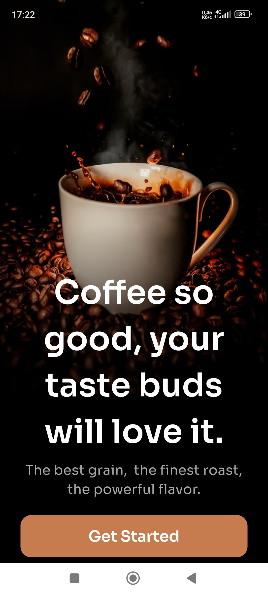
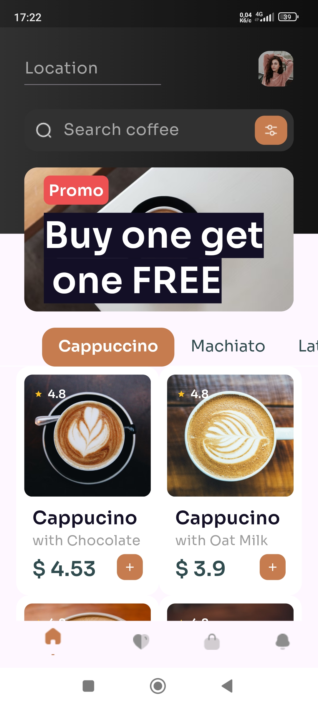
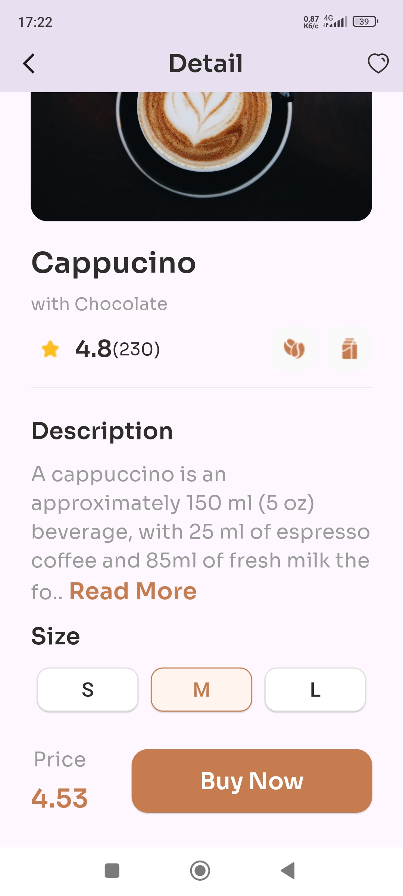
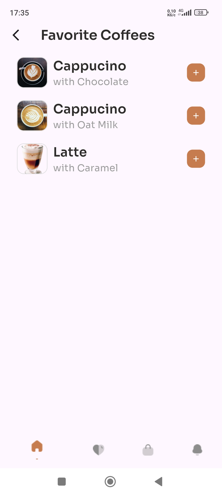
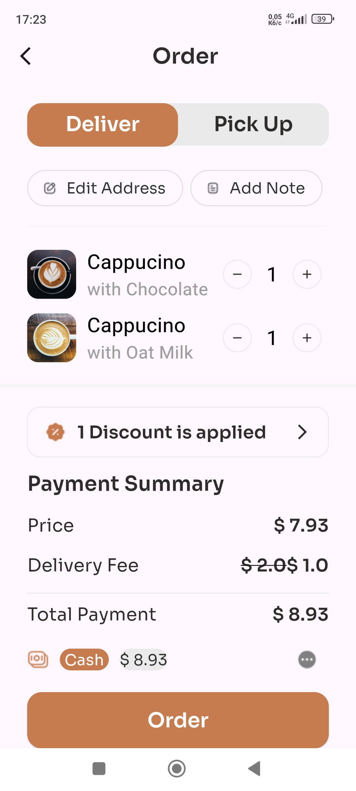
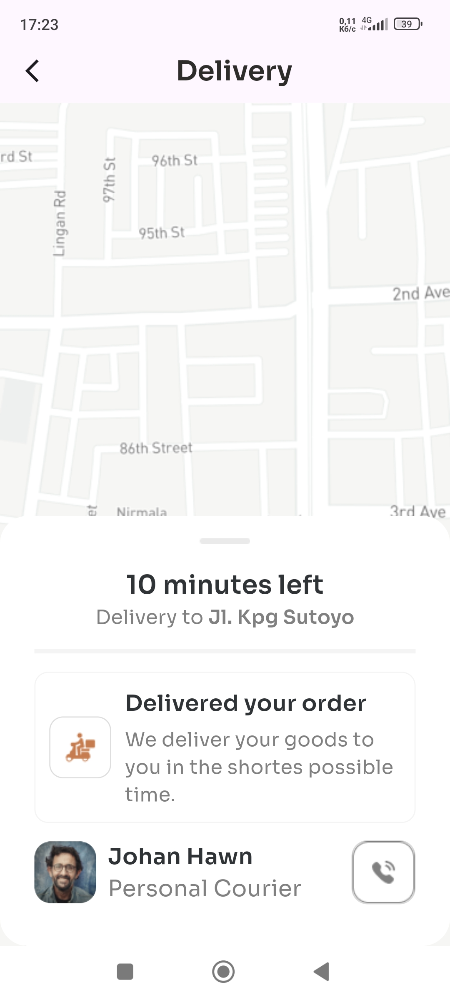

# Flutter Portfolio Project

This Flutter project was created exclusively for the portfolio of Kravchenko A. I, Kravchenko A., am a young aspiring developer looking for opportunities to further develop my skills and find a job.

**Important Note**: This application is not a finished project and is still under development.

## Design

The application's design is based on free Figma designs. Pages that are not included in the original design have been created in adherence to the main style.

Original design available at: [Coffee Shop Mobile App Design](https://www.figma.com/community/file/1116708627748807811/coffee-shop-mobile-app-design)

## Screenshots

## Contact

For inquiries, you can reach the author of this application via email: shaytankay@gmail.com

Thank you for viewing my work.
